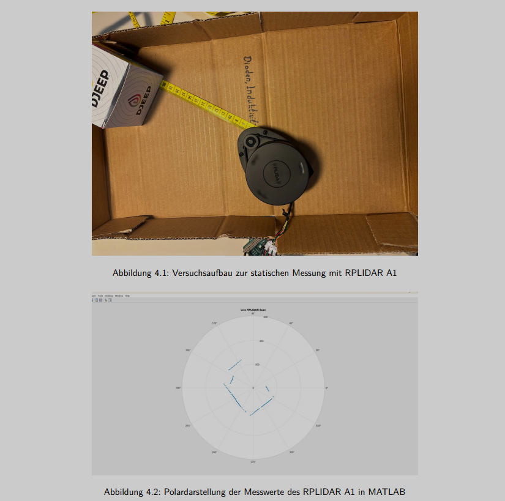

# Real-Time-LiDAR-Mapping
Real-time LiDAR data acquisition using Arduino Due and MATLAB polar visualization.
## Example Output

LiDAR 360° polar visualization generated in MATLAB.

## Hardware

- RPLIDAR A1 LiDAR sensor
- Arduino Due
- USB connection to PC
## Libraries Used

This project uses the following external libraries:

- **RPLIDAR Arduino Library** from RoboPeak / Slamtec  
  Used for communication with the RPLIDAR sensor.

GitHub repository:  
https://github.com/Slamtec/rplidar_sdk

Install the library in the Arduino IDE before uploading the sketch.

## System Architecture

RPLIDAR Sensor  
↓ UART  
Arduino Due (Data acquisition)  
↓ USB Serial  
MATLAB (Polar map visualization)
